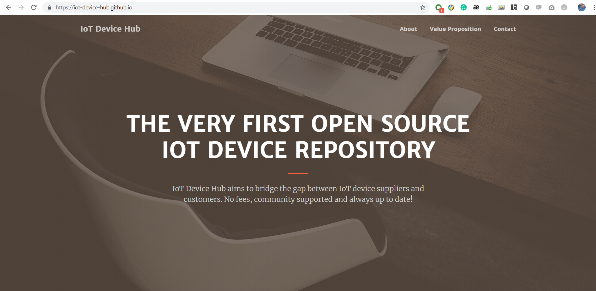

# IoT Device Hub

IoT Device Hub project is providing a fully open sourced "market place" to list all the IoT Device product information. It is a multi-sided platform aims to fill the gap between those IoT Product providers and those end customers. It was designed to be open sourced to solve 3 main challenges:

1. Difficult to maintain an update to date IoT Device Repo
IoT industry is evolving in a super fast manner, so do all the sensors, gateways and all kinds of IoT devices. Your market scan lists become obsolete overnight. Your internal stakeholders are always complaining and demanding new sensors.
2. Existing marketplace is centralized and product are listed in a biased way
To maintain the server to host a website and update sensor list is a lot of work. Not to mention that one single organization cannot collect all the martket data, we are always limited in types and brands that are commercially associated to that organization
3. There is no publically agreed way (format) to gather IoT Device information to ease searching
Google is a good start when you start to look for your IoT Devices. However, results are mostly Ads or a few centralized sensor market that don't really help. IoT products information is uploaded to the internet in different format, which makes searching difficult.

Utilizing GitHub public Repository and GitHub Page, we are creating a place where all the IoT device suppliers can contribute their IoT device information to the whole world without any cost. End consumers or enterprises can use the GitHub Page site to search our data repository to find the devices effectively. 

## Who is using it?
IoT device suppliers: of course, we need you to put your product here! No commission. You will receive FREE explorsure of your product.

Consumers who want to buy IoT product: This is gonna become your sinlge point of searching your IoT products. No need to waste time Googling. 

## How it works?

### End consumers
We have built everything for you. Just go to our GitHub page: https://iot-device-hub.github.io, and start your search!

### IoT device suppliers
We store IoT Device information in a JSON file in our page1/data folder, and use javascript to query the data and display it on the [website](https://iot-device-hub.github.io/page1/page1.html). All hosted in GitHub Page. 

## Contribution
To submit your IoT Device Catalog just like you create a pull request (PR) to submit new code, update your device info like create a bug fix. We are playing the rule exactly like other developers in GitHub.

If you have nevered made contribution in GitHub through a PR, please follow this GitHub Project to get yourself ready.
https://github.com/firstcontributions/first-contributions. 

### Device catalog
All IoT Device information must be submitted in JSON in the pager1/data folder. You have to follow the below rules to make sure your PR be accepted. 

1. Use the latest tempalate to load your device info. It can be found under the folder [page1](https://github.com/iot-device-hub/iot-device-hub.github.io/tree/master/page1), named template.json. 
2. Write only relevant "values" for each attribute, too many text description and irrelevant key words will get you a rejection.
3. Naming convention of your JSON file must follow: <supplier name><sensor name><snesor type ID>.json
4. add your JSON file into the manifest.json file

### Website contribution
We have a very minimal function website to keep things simple, but it doesn't mean we don't want to improve. Currently we label issues and PR for anything we want to add or upgrade for the website. You can also contact us in our Slack if you dislike our site ;-)

## Acknowledgement
Without the following names we won't be able to achieve this. The first step is always the hardest and loneliest. Appreciate your help.
[Yudi Xu](https://www.linkedin.com/in/xuyudi/)
[Sebass van Boxel](https://www.linkedin.com/in/sebassvanboxel/)
[Sasitha Asaranga](https://www.linkedin.com/in/sasitha-asaranga-821795103/)
[Brian de Vuijst](https://www.linkedin.com/in/brian-de-vuijst-347a6a52/)
[Marlena Nickel Johnson](https://www.linkedin.com/in/marlena-nickel-johnson-m-acc-06966982/)
[Yvo Thal](https://www.linkedin.com/in/yvothal/)

## Roadmap
To be updated.
